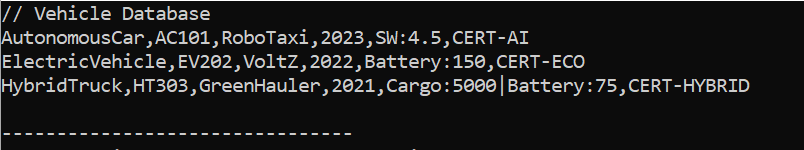
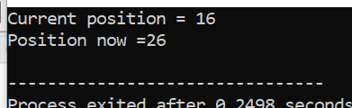
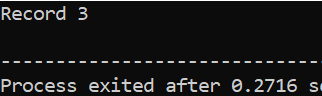

**24k-0578 Ali Hussain OOP lab10 outputs:**

**Q1:**

{width="5.583619860017498in"
height="1.0417202537182852in"}

**Q2:**

{width="2.590411198600175in"
height="3.3751738845144357in"}

**Q3:**

{width="1.7220898950131234in"
height="2.7028062117235345in"}

**Q4:**

{width="1.312567804024497in"
height="0.7569838145231846in"}

**Q5:**

{width="1.5625798337707786in"
height="1.2986778215223098in"}

**Q6:**

{width="1.8612062554680664in"
height="0.8125415573053368in"}

**Q7:**

{width="2.715417760279965in"
height="0.8333759842519685in"}

**Q8:**

{width="2.645968941382327in"
height="0.8542104111986002in"}

**Q9:**

{width="2.312619203849519in"
height="0.7778182414698163in"}

**Q10:**

{width="2.2362259405074365in"
height="0.6667005686789151in"}
