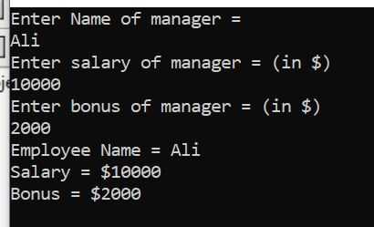
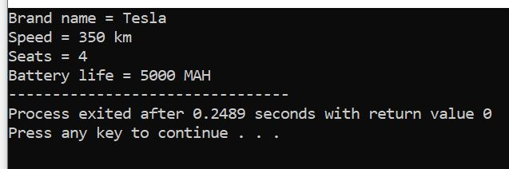
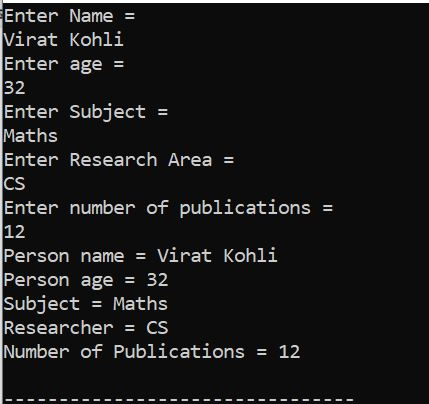
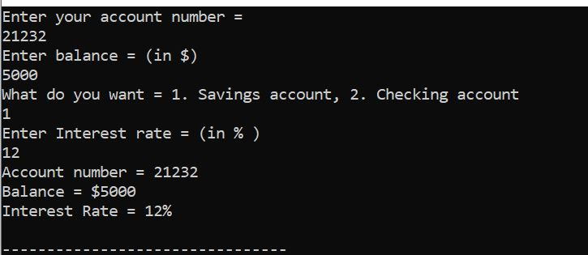
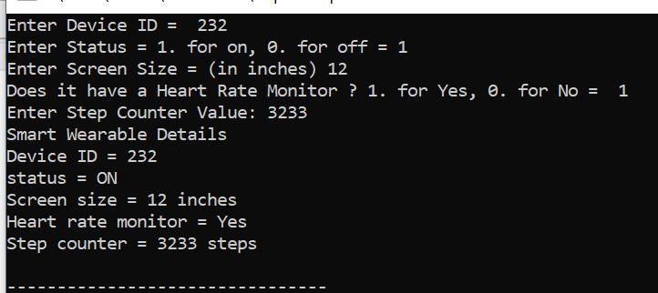

OUTPUT 1:

{width="2.8472222222222223in"
height="1.7291666666666667in"}

OUTPUT 2:

{width="4.423611111111111in"
height="1.4722222222222223in"}

OUTPUT 3:

{width="2.9791666666666665in"
height="2.8055555555555554in"}

OUTPUT 4:

{width="5.034722222222222in" height="2.1875in"}

OUTPUT 5:

{width="5.013888888888889in"
height="2.236111111111111in"}
