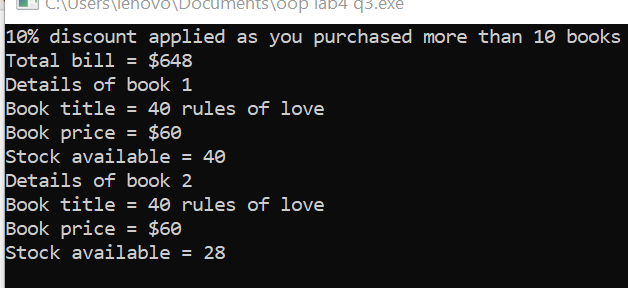

Q1:

{width="2.340398075240595in"
height="1.3195122484689414in"}

Q2:

{width="4.4030041557305335in"
height="1.1111679790026248in"}

Q3:

{width="4.36133530183727in"
height="2.0001027996500436in"}

Q4:

//used this pointer in code

{width="5.194711286089239in"
height="2.069550524934383in"}

Q5:

{width="4.36133530183727in"
height="2.215391513560805in"}
